# Cracking

## Informations

- Website  : reversing.kr 
- Filename : Easy_UnpackMe.exe 
- Sha256   : b4d90c754de829482d70d47593ecedc2d518c8d902347da55e325bf7709d2134 
- Filetype : PE32 executable (GUI) Intel 80386, for MS Windows

## Analysis

### First look

The file Easy_UnpackMe.exe is a PE32 executable cracking challenge as shown by CFF Explorer.


But the file info is undefined.

Launching PEiD gives us the following information about the sections:

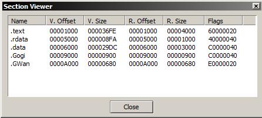

The .Gogi and .GWan section are weird, and the entry point of the program is set the to .GWan section, so it may be packed (the name of the challenge gives us a hint about that).

A ReadMe.txt file is giving us some informations about our objective :

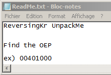

We will have to unpack the program, and the flag will be the entry point of the unpacked program.

Having a look into binary ninja in order to understand how it works, you can see in the following graph of the start address function :
- Start block
- Import Address Table unpack (highlighted in blue)
- Import Address Table Resolution (highlighted in green)
- Executable code unpack (highlighted in orange)
- .data unpack (highlighted in red)
- Executable code packed (highlighted in black)

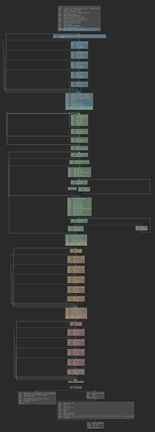

### Packer steps

#### Executable code packed

We can determine that this code is packed, due to the loops with xor's before, and also unconsistant instructions.

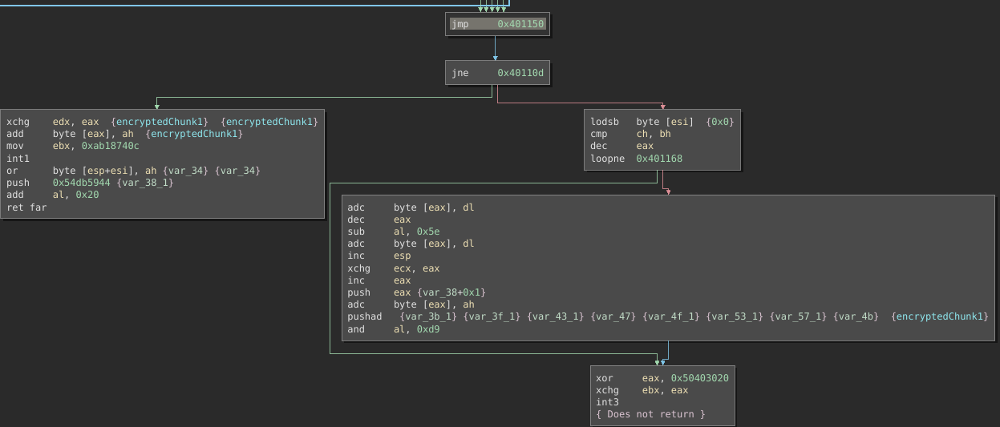

So we need to analyze the loops in order to understand how to unpack this.

#### Starting block

The starting block consists of resolving at runtime the address of kernel32.dll module and it's functions (FreeLibrary and GetModuleHandle).

Then it will mov the start address of the first encrypted chunk in ecx, and the end in edx.

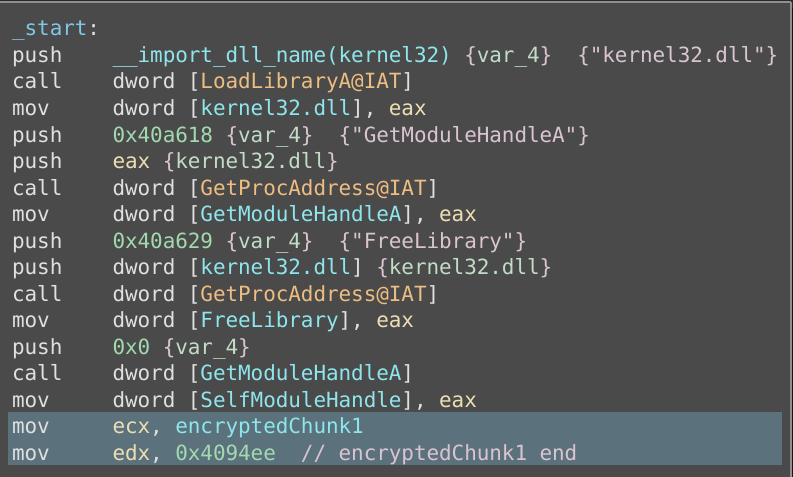

#### IAT unpack

The Import Address table start address is stored in ecx.

It consists of a call table of user-space modules. All the functions address will be written here.

The loop will simply xor all the import address table with the key "\x10\x20\x30\x40\x50", and also change the memory page protection of the .rdata section with Read/Write.

The decrypted block will contain the name of the functions that will be loaded at runtime by the IAT Resolution block.

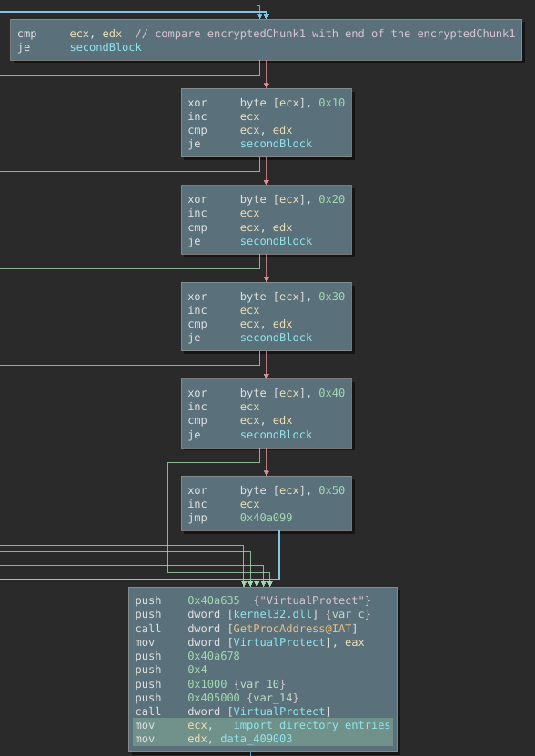

#### IAT resolution

This block consists of iterating over the function names that have been decrypted by the IAT unpack routine, and loading at runtime these functions.

Loading the modules will be done by iterating on the function names and calling the LoadLibrary from the WINAPI that consists of loading a module in memory.

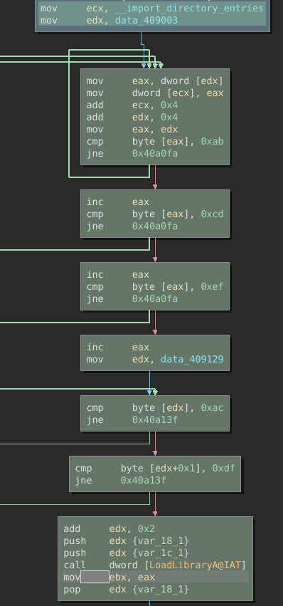

Getting the address the functions with the GetProcAddress WINAPI function and storing them in memory.

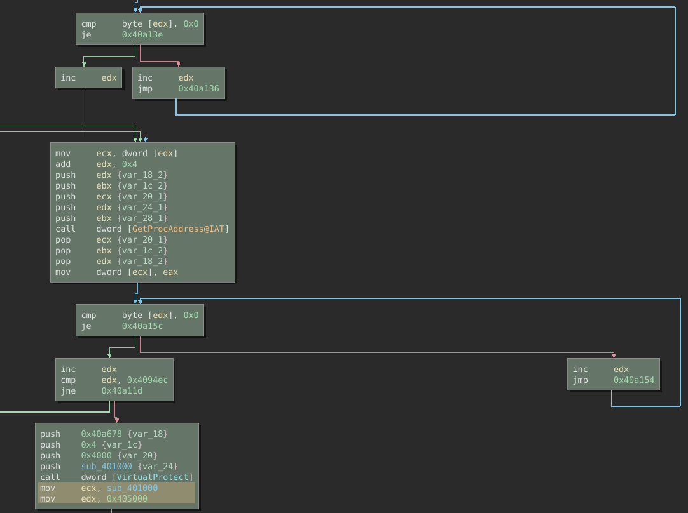

At the end, it will change the permission of the executable code by giving it Writing rights to unpack it.

#### Executable code unpack

This loop consists of unpacking the executable code with the key "\x10\x20\x30\x40\x50", the same way it did with the IAT unpack.

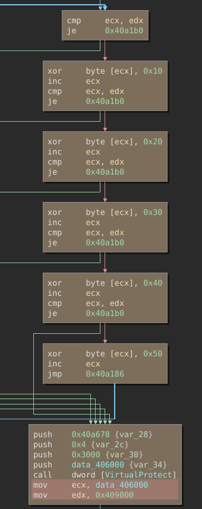

#### .data unpack

This loop consists of unpacking the .data section with the key "\x10\x20\x30\x40\x50" the same way it did with the IAT unpack.

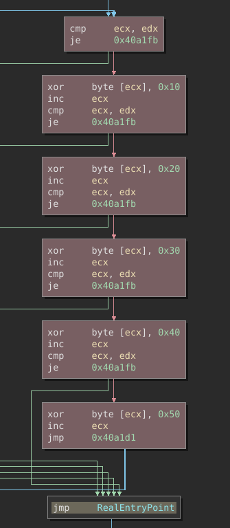

And then jumping on the unpacked code, so the real entry point of the program is : "0x401150".

#### Unpacked code

The unpacked code will simply create a white window.


### Unpacking with Binja API

We can use binary ninja api in order to unpack the packed code and reproduce all the unpack of the malware.

```python
from binaryninja import *
import time

filepath = "/home/lexsek/GITHUB/Cracking/reversing.kr/EasyUnpack/files/Easy_UnpackMe.exe"
dbpath = "/home/lexsek/GITHUB/Cracking/reversing.kr/EasyUnpack/Easy_UnpackMe.bndb"
fm = FileMetadata()
db = fm.open_existing_database(dbpath)
bv = db.get_view_of_type('PE')
br = BinaryReader(bv)
bw = BinaryWriter(bv)
bv.update_analysis()
time.sleep(1)

packed = bv.start + 0x1000
count = bv.start + 0x5000 - packed
print count

br.seek(packed)
bw.seek(packed)

key = [0x10, 0x20, 0x30, 0x40, 0x50]

for b in range(0, count):
    data = ord(br.read(1)) ^ key[b % len(key)]
    print chr(bw.write(chr(data)))

fm.create_database("/home/lexsek/GITHUB/Cracking/reversing.kr/EasyUnpack/unpacked.bndb")
print fm.saved
```

Now the jmp 0x401150 points to valid code !

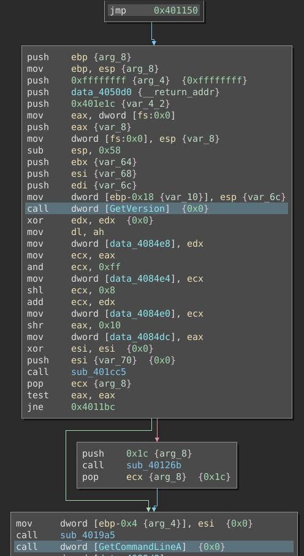

### Conclusion

The unpack program starts at the address "401150", so looking at the ReadMe.txt file gives us the right format to validate the challenge and gives us the web browser alert telling us we validated (or alrady have valited) the challenge.

Flag : "00401150"

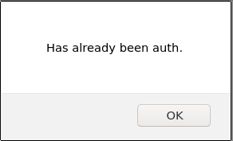